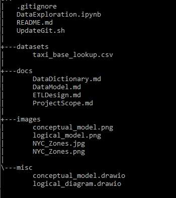

## Udacity Capstone Project - TLC Taxi trips Data Warehouse Project


**Name: Darren Foley**

**Creation Date: 2021-10-21**

**Last Modified Data: 2021-11-13**

-------------------------------------------------------

<br>

### Project Index




<br>

### Project Setup

**Versioning & Compatiblity**

<p>Airflow DAG's were written and tested in ubuntu 16.04 VM running Airflow version 1.10.2 installed in python 3.6</p>

```
# uname -a 
Linux 0ed8a3d2ab28 4.15.0-1098-gcp #111~16.04.1-Ubuntu SMP Tue Apr 13 19:05:08 UTC 2021 x86_64 x86_64 x86_64 GNU/Linux
```


```
# airflow version
  ____________       _____________
 ____    |__( )_________  __/__  /________      __
____  /| |_  /__  ___/_  /_ __  /_  __ \_ | /| / /
___  ___ |  / _  /   _  __/ _  / / /_/ /_ |/ |/ /
 _/_/  |_/_/  /_/    /_/    /_/  \____/____/|__/
   v1.10.2
```

```
# python --version
Python 3.6.3
```

<br>

**Prerequisites**

<p>There are a number of prerequisites that are required before the Airflow pipelines can be run. Within the Airflow folder there is a setup file (/airflow/setup.py) which should handle all of the dependencies. Just run from your command line environment as shown:</p>

```
# ./setup.py
```

This script does two things:

1. Installs Python Packages

<p>The ETL pipelines process and load geometric shape data which heavily relies on the geopandas (version: geopandas==0.9.0) package in python 3.6. This must be installed before the DAG's can run correctly. The newest version of pip must also be upgraded before installation. </p>

```
pip install --upgrade pip

pip install geopandas

```

2. Creates an S3 Staging Bucket

<p>The next dependency is to create a local S3 bucket to hold lookup data before being loaded into Redshift. This will act as a staging area for shape files. Remember that the bucket name must be set in airflow UI before DAGS can be run.</p>

<br>

**Create the Redshift Cluster**

<p>As described within the project scope, the design requires a ra3.xlplus RA3 node cluster. Use the "create_cluster.sh" script in project root to spin up the cluster before running the DAGs.</p>

```
# ./create_cluster.sh -h
./create_cluster.sh [-h|help] [-T|testing] [-P|production] [-d|delete] <cluster-identifier>

# ./create_cluster.sh -P
creating cluster......
```

<br>

**Set Airflow Connection Parameters**

1. AWS User

<p>You'll need to create an AWS user which has access to load data into Redshift from S3. These credentials must be be set in the airflow UI as "aws", which will be picked up by the dags during execution.</p>

2. Redshift Hostname

<p>The redshift Hostname will need to be added into the Airflow UI as "redshift", which will be picked up by the dags during execution. </p>


3. S3 Local Bucket Name

<p>As mentioned above, set the bucket name as "local_bucket", which will be picked up by the dags during execution. </p>


4. Add HOME_ variable to indicate DAG home directory

<p>Location of the Home directory where dags are located. (Default: /home/workspace/airflow/dags)</p>

<br>

### Documentation

1. Project Setup

2. [Project Scope](docs/ProjectScope.md) 

3. [Data Dictionary](docs/DataDictionary.md)

4. [Data Model](docs/DataModel.md)

5. [ETL Design](docs/ETLDesign.md) 
